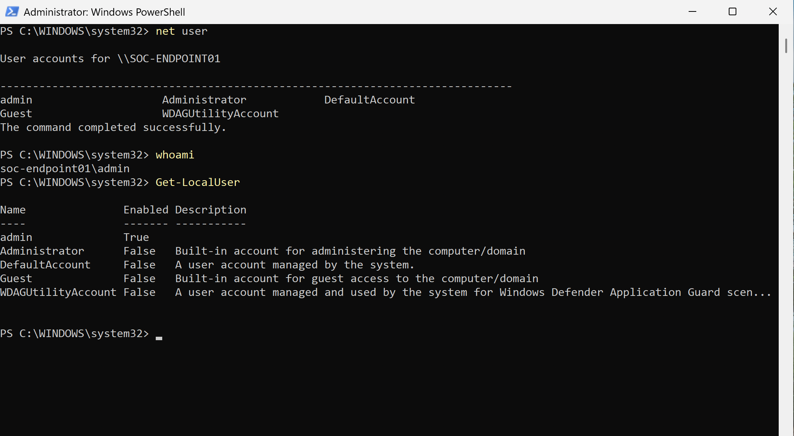
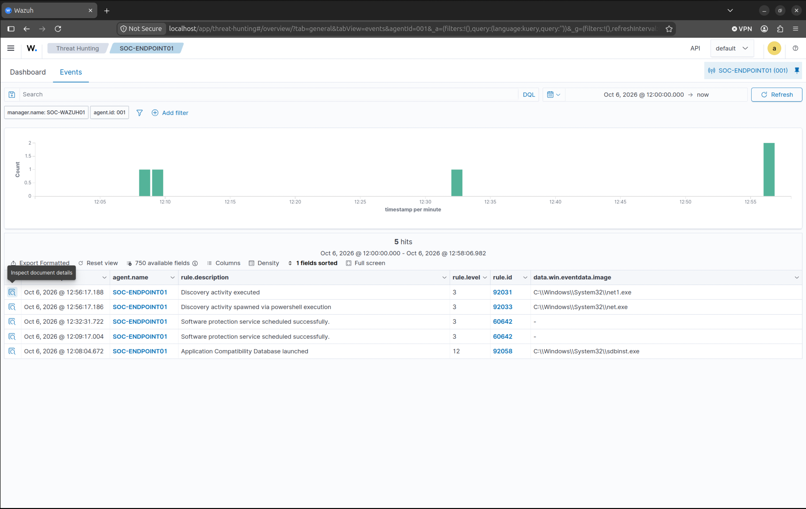
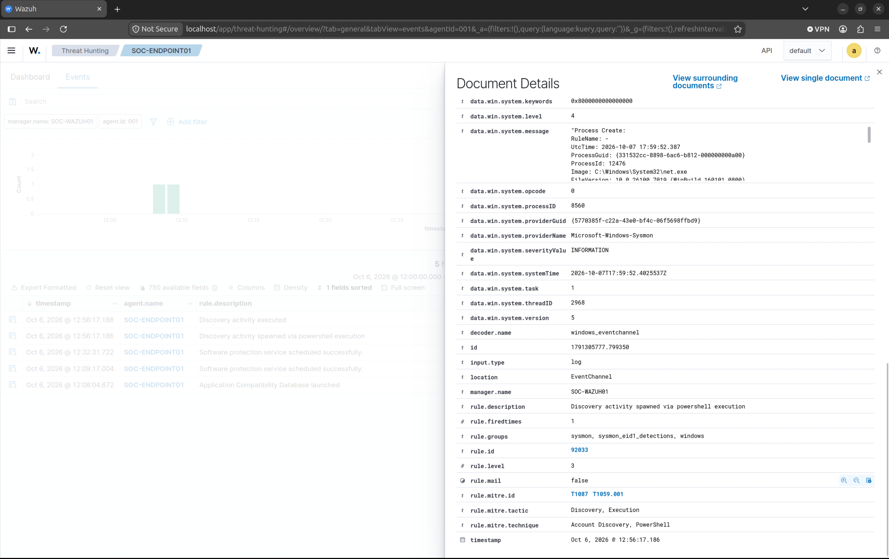

# Investigation 003 - Account Discovery Activity

## Summary

This investigation documents the detection and analysis of account discovery activity performed on the Windows endpoint SOC-ENDPOINT01.

The objective was to validate visibility into user and account enumeration activity through Sysmon, PowerShell Logging, and Wazuh telemetry.

Account discovery techniques are commonly observed during the reconnaissance phase of an intrusion and may indicate an attempt to identify local users, privileges, or administrative accounts.

---

## Environment

### SIEM

- Wazuh 4.14

### Monitoring Server

- Hostname: SOC-WAZUH01
- Operating System: Ubuntu Desktop 26.04 ARM64

### Endpoint

- Hostname: SOC-ENDPOINT01
- Operating System: Windows 11 ARM
- Wazuh Agent Installed
- Sysmon ARM64 Installed
- PowerShell Logging Enabled

---

## Objective

Validate the ability to detect and investigate account discovery activity using endpoint telemetry and threat hunting capabilities within Wazuh.

---

## Activity Performed

The following commands were executed on SOC-ENDPOINT01:

```powershell
whoami

net user

Get-LocalUser
```

These commands were used to generate account discovery telemetry for analysis.

---

## Detection Sources

- Sysmon Event ID 1 (Process Creation)
- PowerShell Script Block Logging
- Wazuh Threat Hunting
- Windows Event Logs

---

## Observed Events

The following activity was observed:

- Account enumeration activity
- User context discovery
- PowerShell command execution
- Process creation events
- Event telemetry forwarded to Wazuh

The event was successfully identified within Wazuh and mapped to MITRE ATT&CK techniques associated with account discovery and PowerShell activity.

---

## MITRE ATT&CK Mapping

| Technique ID | Technique |
|-------------|-----------|
| T1087 | Account Discovery |
| T1059.001 | PowerShell |

---

## Findings

The investigation confirmed:

- Account discovery activity was successfully captured by Sysmon
- PowerShell execution telemetry was visible within Wazuh
- Process creation events were correlated to executed commands
- Threat Hunting capabilities provided visibility into enumeration activity
- Endpoint telemetry was centralized and available for investigation

---

## Conclusion

The Security Operations Monitoring Environment successfully detected and collected account discovery activity generated on the Windows endpoint.

Sysmon, PowerShell Logging, and Wazuh provided visibility into user enumeration behavior and enabled investigation of activity commonly associated with the reconnaissance phase of an attack.

This investigation further validated the effectiveness of the monitoring environment and demonstrated visibility into MITRE ATT&CK account discovery techniques.

---

## Evidence

### Command Execution



PowerShell commands were executed on SOC-ENDPOINT01 to generate account discovery telemetry.

### Threat Hunting Results



Threat Hunting was used to analyze correlated telemetry and validate event visibility.

### Account Discovery Event



Wazuh identified account discovery activity and mapped the event to MITRE ATT&CK technique T1087.

### Status

✅ Complete