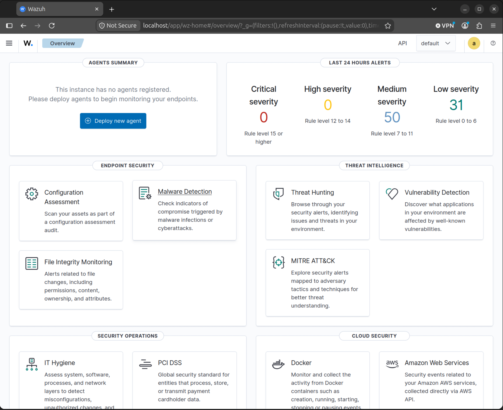
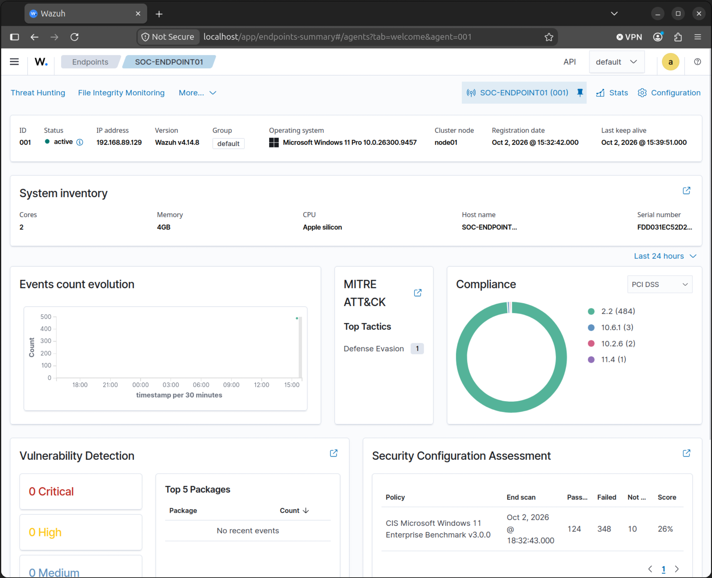
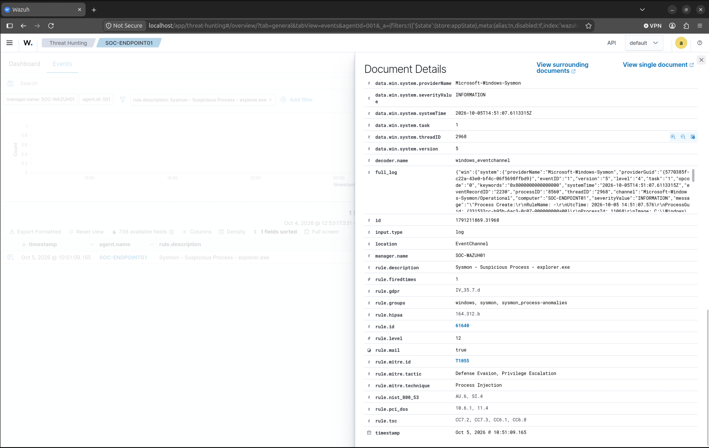
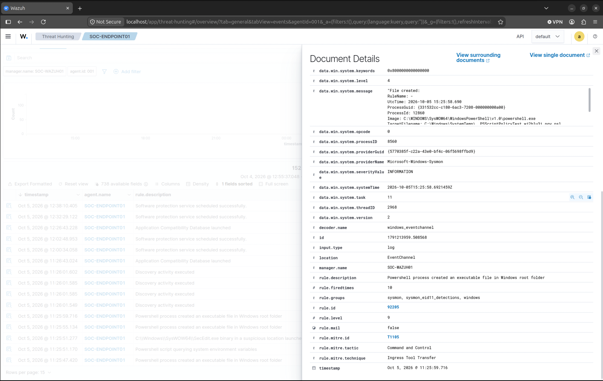

# Security Operations Monitoring Environment
 
## Overview
 
This project documents the design, deployment, and operation of a Security Operations Monitoring Environment built to develop practical experience in security monitoring, threat detection, endpoint visibility, and incident investigation.
 
The environment leverages Wazuh, Sysmon, PowerShell logging, and Windows endpoint telemetry to simulate security operations workflows commonly performed by Security Operations Center (SOC) analysts.
 
Key focus areas include:
 
- Security Monitoring
- SIEM Administration
- Log Collection and Analysis
- Threat Detection
- Endpoint Telemetry
- Incident Investigation
- Threat Hunting
- Detection Engineering
- MITRE ATT&CK Mapping
 
---
 
## Project Objectives
 
- Develop hands-on experience with security monitoring platforms
- Deploy and manage a SIEM environment
- Collect and analyze Windows endpoint telemetry
- Investigate security events and alerts
- Design and validate detection use cases
- Conduct threat hunting activities
- Produce portfolio-quality investigation reports
- Demonstrate practical cybersecurity skills applicable to Security Operations roles
 
---
 
## Architecture
 
```text
MacBook Pro 16" (M1 Pro)
│
├── SOC-WAZUH01
│ ├── Ubuntu Desktop 26.04 ARM64
│ ├── Wazuh Manager
│ ├── Wazuh Indexer
│ └── Wazuh Dashboard
│
└── SOC-ENDPOINT01
├── Windows 11 ARM
├── Wazuh Agent
├── Sysmon ARM64
└── PowerShell Logging
```
 
---
 
## Environment Specifications
 
### Host System
 
- Apple MacBook Pro 16"
- Apple M1 Pro
- 16 GB RAM
- VMware Fusion
 
### Security Platform
 
- Wazuh SIEM
- Wazuh Dashboard
- Wazuh Indexer
- Wazuh Agent
 
### Endpoint Monitoring
 
- Sysmon ARM64
- Windows Event Logging
- PowerShell Script Block Logging
 
### Operating Systems
 
- Ubuntu Desktop 24.04 ARM64
- Windows 11 ARM
 
---
 
## Current Environment Status
 
### Infrastructure Deployment
 
Completed
 
- VMware Fusion Deployment
- Ubuntu Deployment
- Windows Deployment
- Network Configuration
- System Updates
- Snapshot Management
 
### SIEM Deployment
 
Completed
 
- Wazuh Installation
- Wazuh Manager Configuration
- Wazuh Indexer Configuration
- Wazuh Dashboard Deployment
 
### Endpoint Telemetry
 
Completed
 
- Endpoint Enrollment
- Sysmon ARM64 Deployment
- PowerShell Logging Configuration
- Sysmon Log Collection
- Endpoint Telemetry Validation
- Log Ingestion Verification
 
---
 
## Telemetry Validation
 
The following telemetry sources have been successfully validated:
 
- Windows Security Logs
- Sysmon Process Creation Events
- Sysmon DNS Query Events
- PowerShell Execution Events
- Wazuh Agent Communications
- Windows Endpoint Inventory Data
 
---

## Environment Screenshots

### Wazuh Dashboard



### Active Endpoint Enrollment



### Sysmon Telemetry



### PowerShell Telemetry


---

 
## MITRE ATT&CK Coverage
 
Current investigations and detections focus on:
 
| Technique ID | Technique |
|--------------|------------|
| T1033 | System Owner/User Discovery |
| T1087 | Account Discovery |
| T1016 | Network Discovery |
| T1082 | System Information Discovery |
| T1046 | Network Service Discovery |
| T1059.001 | PowerShell |
 
---
 
## Investigations
 
### Investigation 001 – PowerShell and Sysmon Telemetry Validation
 
Status: Complete
 
Objective:
 
Validate the collection, ingestion, and analysis of endpoint telemetry generated from Sysmon and PowerShell logging.
 
Activities:
 
- PowerShell Execution
- Process Creation Monitoring
- DNS Query Analysis
- Threat Hunting Validation
- Event Correlation in Wazuh
 
### Investigation 002 – Encoded PowerShell Execution Analysis
 
Status: Complete
 
Objective:
 
Analyze and validate detection visibility for encoded PowerShell execution activity using Sysmon and PowerShell telemetry.
 
Activities:
 
- EncodedCommand Execution
- Process Creation Analysis
- PowerShell Event Review
- Threat Hunting Validation
- MITRE ATT&CK Mapping
 
---
 
## Skills Demonstrated
 
- SIEM Administration
- Security Monitoring
- Threat Hunting
- Detection Engineering
- Log Analysis
- Sysmon Configuration
- PowerShell Logging
- Windows Security Monitoring
- Endpoint Visibility
- MITRE ATT&CK Mapping
- Incident Investigation
- Security Documentation
 
---
 
## Author
 
Jabari Neal-Jackson
 
Current Role:
Network Administrator I
 
Target Roles:
 
- SOC Analyst
- Cybersecurity Analyst
- Security Operations Analyst